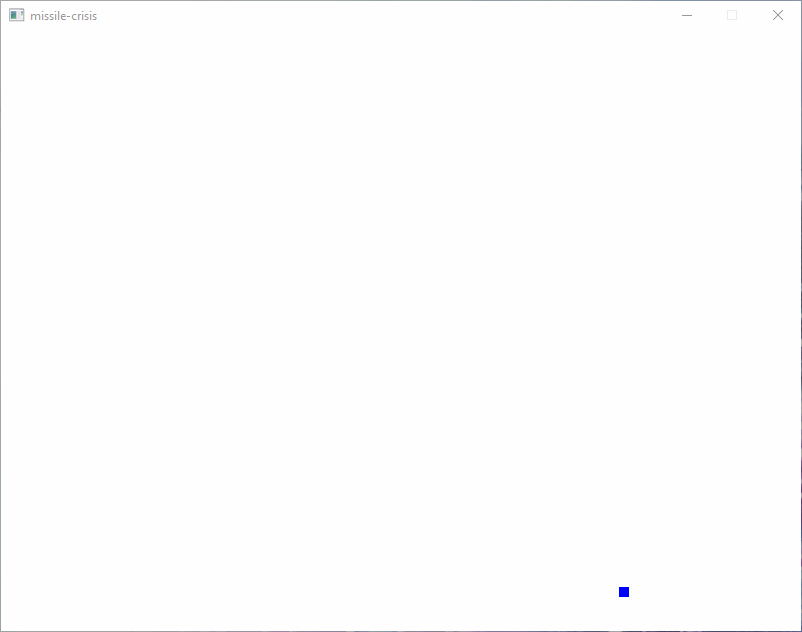
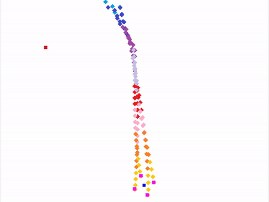
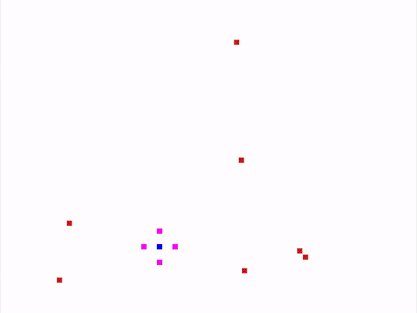

# missile-carnival
Not really a carnival.

## Moving/Shooting

## Homing Missiles

### No rotation

### With rotation

## Building/Running

1. Install Rust/Cargo - https://doc.rust-lang.org/cargo/getting-started/installation.html
2. Run using `$ cargo run --release`
